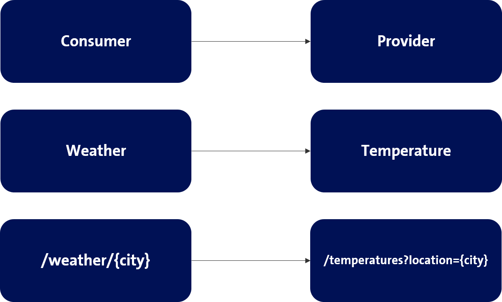

# Temperatures app

An example application that provides temperatures for locations.

Example:
```
http://localhost:8081/temperatures?location=Zurich

{
  "location": "Zurich",
  "temperature": 19.9
}

```

Build and run Pact provider tests
```
mvn clean verify

```

Build and run Pact provider tests and publish verification
```
mvn clean verify -Dpact.verifier.publishResults=true
```

# Overview



