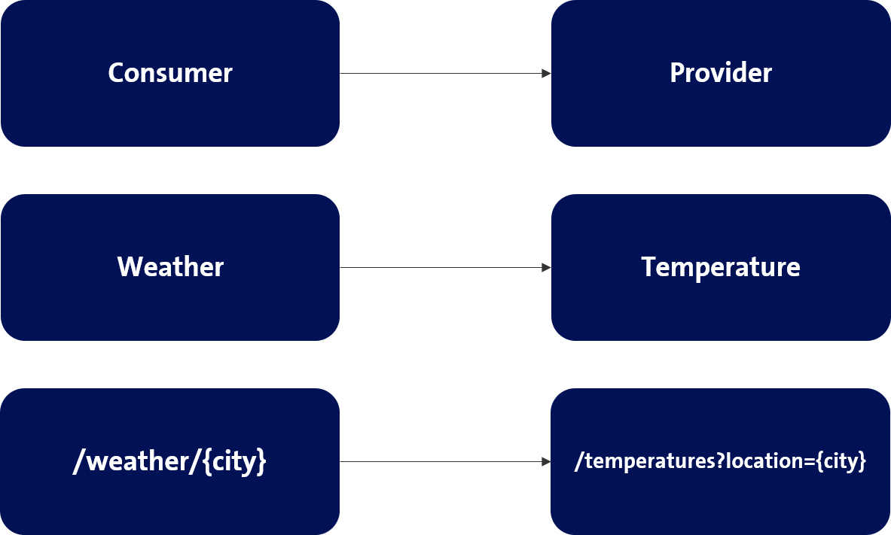

# Weather application

An example application that provides weather information for cities.

Example:
```
http://localhost:8080/weather/Zurich

{
  "message": "The weather in Zurich is fine and the temperature is 19.9 °."
}

```

Build and run Pact consumer tests
```
mvn clean verify
```
Find your contract in `target/pacts`.

Publish contract to cdc-manager (this needs a valid technical user
for the cdc-system `consumer-demo` in cdc-manager)
```
mvn pact:publish
```

# Overview

